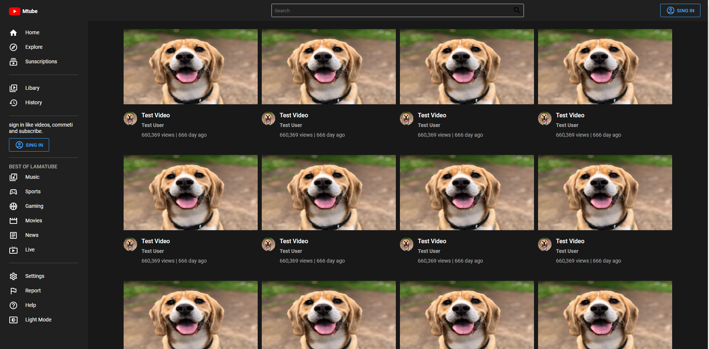
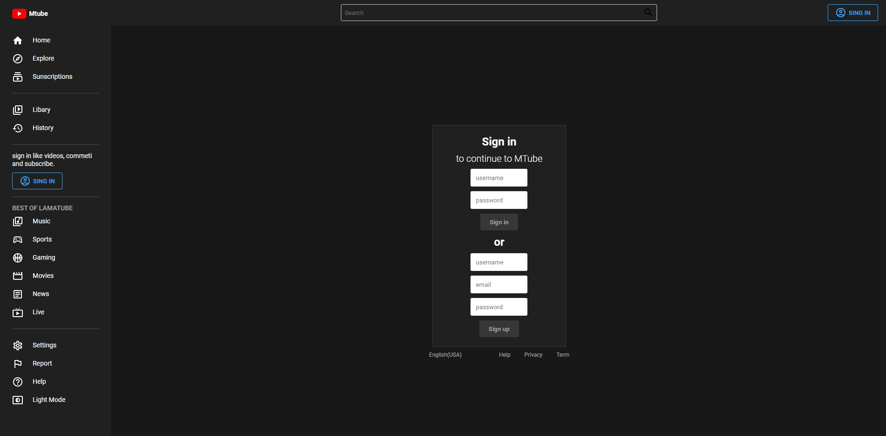
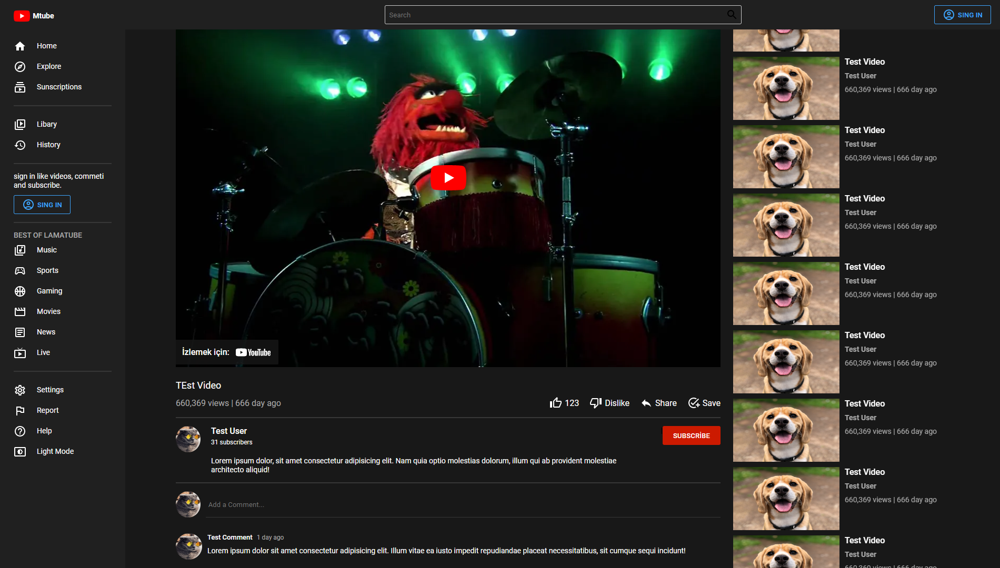

# Youtube Clone Front End
 This site is just the frontend of the Youtube-Clone repository.

 ## How Can I use
- Download the code
- Install all dependencies using the **npm i** or **yarn** code
- Start the app using the npm start or yarn start command.
- The app will launch on your default browser.

## Dependencies
-JavaScript 
-React 
-ReactRouter 
-Styled Components 
-Material UI

## Photos

